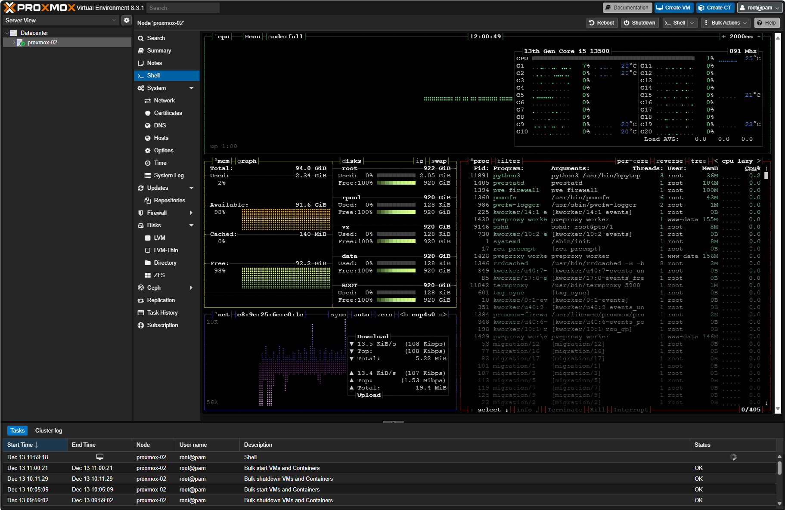
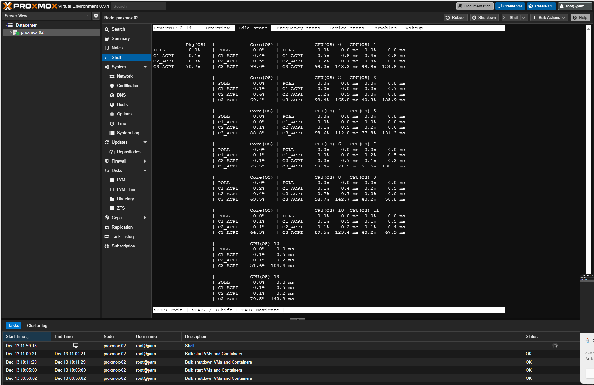

# New homelab

My homelab hardware was getting old so this black friday I wanted to order some new parts. 

My requirements were 

  - Smallish form factor.
  - Fit minimum of 4 HDD:s.
  - Be able to run containers and virtual machines for home automation, dns, backups and reverse proxy 24/7.
  - Be able to run network labs when needed.
  - A chassis that fit a ATX power supply.
  - A option to in the future install a GPU for LLMs.
  - Reasonable power usage.

This is what i came up with:

Type|Item
:----|:----
**CPU** | [Intel Core i5-13500 2.5 GHz 14-Core Processor](https://pcpartpicker.com/product/mtmmP6/intel-core-i5-13500-25-ghz-14-core-processor-bx8071513500)
**CPU Cooler** | [Noctua NH-L9i-17xx chromax.black 33.84 CFM CPU Cooler](https://pcpartpicker.com/product/nJqPxr/noctua-nh-l9i-17xx-chromaxblack-3384-cfm-cpu-cooler-nh-l9i-17xx-chromaxblack)
**Motherboard** | [Asus ROG STRIX B760-I GAMING WIFI Mini ITX LGA1700 Motherboard](https://pcpartpicker.com/product/YxLFf7/asus-rog-strix-b760-i-gaming-wifi-mini-itx-lga1700-motherboard-rog-strix-b760-i-gaming-wifi)
**Memory** | [Crucial Pro 96 GB (2 x 48 GB) DDR5-5600 CL46 Memory](https://pcpartpicker.com/product/BLdG3C/crucial-pro-96-gb-2-x-48-gb-ddr5-5600-cl46-memory-cp2k48g56c46u5)
**Storage** | [Western Digital Blue 1 TB 2.5" Solid State Drive](https://pcpartpicker.com/product/GTCD4D/western-digital-blue-1tb-25-solid-state-drive-wds100t2b0a)
**Storage** | [Western Digital Blue 1 TB 2.5" Solid State Drive](https://pcpartpicker.com/product/GTCD4D/western-digital-blue-1tb-25-solid-state-drive-wds100t2b0a)
**Storage** | [Kingston KC3000 1.024 TB M.2-2280 PCIe 4.0 X4 NVME Solid State Drive](https://pcpartpicker.com/product/ccFbt6/kingston-kc3000-1024-tb-m2-2280-nvme-solid-state-drive-skc3000s1024g)
**Storage** | [Kingston KC3000 1.024 TB M.2-2280 PCIe 4.0 X4 NVME Solid State Drive](https://pcpartpicker.com/product/ccFbt6/kingston-kc3000-1024-tb-m2-2280-nvme-solid-state-drive-skc3000s1024g)
**Storage** | [Seagate IronWolf NAS 4 TB 3.5" 5900 RPM Internal Hard Drive](https://pcpartpicker.com/product/6MX2FT/seagate-ironwolf-4tb-35-5900rpm-internal-hard-drive-st4000vn008)
**Storage** | [Seagate IronWolf NAS 4 TB 3.5" 5900 RPM Internal Hard Drive](https://pcpartpicker.com/product/6MX2FT/seagate-ironwolf-4tb-35-5900rpm-internal-hard-drive-st4000vn008)
**Case** | [Fractal Design Node 304 Mini ITX Tower Case](https://pcpartpicker.com/product/BWFPxr/fractal-design-case-fdcanode304bl)
**Power Supply** | [Asus ROG Strix 650 W 80+ Gold Certified Fully Modular ATX Power Supply](https://pcpartpicker.com/product/DRVG3C/asus-rog-strix-650-w-80-gold-certified-fully-modular-atx-power-supply-rog-strix-650g)

[PCPartPicker Part List](https://pcpartpicker.com/list/ZfTXPJ)


The build was easy but I regret not getting a smaller PSU. The Node 304 fit the ATX PSU without an issue but a SFX PSU would probably make the cable management easier and easier to fit a full size GPU in the future.

01 - Proxmox installation
----------------
I used a previously set up Ventoy usb to which i added the latest proxmox ISO
- https://www.ventoy.net/en/doc_start.html
- https://www.proxmox.com/en/downloads

Boot from the USB and follow the installation guide. I choose to create a ZFS Raid1 mirror using two NVME hard drives for Proxmox and VMs.

After the installation completed i ran the Proxmox VE Helperscript https://community-scripts.github.io/ProxmoxVE/scripts?id=post-pve-install

I also installed bpytop and powertop to monitor temperatures and try to lower power consumption.
 


02 - SSH credentials
----------------
Generate SSH keys with the commands below. You will be prompted to set a password for each key, it's recommended to do so.

``` bash
ssh-keygen -t ed25519 -C "$(whoami)@proxmox-$(hostname)" -f ~/.ssh/proxmox 
ssh-keygen -t ed25519 -C "$(whoami)@homelab-$(hostname)" -f ~/.ssh/homelab  
ssh-keygen -t ed25519 -C "$(whoami)@github-$(hostname)"  -f ~/.ssh/github
```
Copy the proxmox public key to trusted hosts of the proxmox server using ssh-copy-id.
``` bash
ssh-copy-id -i ~/.ssh/proxmox root@10.0.10.10   
```

Edit SSH config to use the generated key and specify which user to use.

``` bash
nano ~/.ssh/config
...
Host github.com
  HostName github.com
  IdentityFile ~/.ssh/github
Host 10.0.10.10
  IdentityFile ~/.ssh/proxmox
  User root
Host 10.0.10.*
  IdentityFile ~/.ssh/homelab
  User robin
...
```

Add the SSH keys that you will use to the SSH agent
``` bash
eval "$(ssh-agent -s)"
ssh-add ~/.ssh/proxmox
ssh-add ~/.ssh/homelab
ssh-add ~/.ssh/github
```

03 - Proxmox API credentials
----------------

To be able to use Ansible and Terraform to manage Proxmox it's recommended to use API credentials instead of username/password combination. To create those credentials follow the steps bellow logged in as root on the Proxmox server.


Add a user:
``` bash
pveum user add homelab@pve
```
Create a role:
```bash
pveum role add HomeLab -privs "Datastore.Allocate Datastore.AllocateSpace Datastore.AllocateTemplate Datastore.Audit Pool.Allocate Sys.Audit Sys.Console Sys.Modify SDN.Use VM.Allocate VM.Audit VM.Clone VM.Config.CDROM VM.Config.Cloudinit VM.Config.CPU VM.Config.Disk VM.Config.HWType VM.Config.Memory VM.Config.Network VM.Config.Options VM.Migrate VM.Monitor VM.PowerMgmt User.Modify"
```
Assign the role to the new user:
```bash
pveum aclmod / -user homelab@pve -role HomeLab
```
Create a authentication token: 
```bash
pveum user token add homelab@pve iac --privsep=0
```
Then you will presented with something similar to below, save the full-tokenid and value in a safe place for later.
```bash
┌──────────────┬──────────────────────────────────────┐
│ key          │ value                                │
╞══════════════╪══════════════════════════════════════╡
│ full-tokenid │ homelab@pve!iac                      │
├──────────────┼──────────────────────────────────────┤
│ info         │ {"privsep":"0"}                      │
├──────────────┼──────────────────────────────────────┤
│ value        │ 207c9ff1-96f3-44d4-8439-87da57f5fc26 │
└──────────────┴──────────────────────────────────────┘
```

04 - Github
----------------
Get the generated github public key and add it to your github account at [Github keys](https://github.com/settings/keys)
```bash
cat .ssh/github.pub
```
Configure git
```bash
git config --global user.name Ragr3n
git config --global user.email robin@ragren.com
```

05 - Dependencies  
----------------
The repo contains files and folders required to manage Proxmox via Ansible, server and container deployment to Proxmox via OpenTofu and NixOS configurations via nixos-rebuild. To make life easier a nix shell is provided with all dependencies that are needed to run Ansible and OpenTofu(Terraform). Get in to the shell by running.

```bash
nix develop
```

05 - SOPS
----------------

Create folder to store age keys in and use the previously generated SSH key to create age keypair.
```bash
mkdir -p ~/.config/sops/age/
nix run nixpkgs#ssh-to-age -- -private-key -i ~/.ssh/homelab > ~/.config/sops/age/keys.txt
nix shell nixpkgs#age -c age-keygen -y ~/.config/sops/age/keys.txt

age1gwmxg9kqrkfqek4lkkv0l70tsjlvftj4jrevu6a8pf0m34smp43qc27wys
```
Copy the age public key that is shown in the terminal and add it to the .sops.yaml file located in the root of the project. If the file doesn't exist create it with this content and change the age key to the one you generated.
```bash
keys:
  - &primary age1gwmxg9kqrkfqek4lkkv0l70tsjlvftj4jrevu6a8pf0m34smp43qc27wys
creation_rules:
  - path_regex: secrets/[^/]+\.(yaml|json|env|ini)$
    #- path_regex: secrets/secrets.yaml$
    key_groups:
      - age:
          - *primary
```

I've saved the clear text version of the secrets/secrets.yaml file in bitwarden but it's also possible to just take the content of secrets/secrets.yaml remove the sops: array and edit the variables since the variable names are stored in clear text. Then use below command to encrypt the file.

```bash
sops -i -e secrets/secrets.yaml
```
Be careful to not commit the file without first encrypting it. Use the VSCode extension @signageos/vscode-sops to easily edit SOPS encrypted files and automatically encrypt them.


06 - Templates
----------------
Change in to the Ansible directory, edit the inventory/proxmox.yaml file and run one or more playbooks to generate VM or LXC templates in Proxmox.
```bash
hl-ansible #Alias for cd *homelabdir*/ansible
code inventory/proxmox.yml
ansible-playbook create-template-nixos-vm.yml inventory/proxmox.yml
ansible-playbook create-template-nixos-lxc.yml inventory/proxmox.yml
ansible-playbook create-template-hassos-vm.yml inventory/proxmox.yml  
```
07 - OpenTofu
----------------
Change in to the tofu directory, copy and or edit tofu files as desired. 

I've chosen to keep the provider config in the main.tf file and separate pve-****-.tf files for each deployed host. This way I can easily edit, create new or destroy a host with out affecting others.

```bash
hl-tofu #Alias for cd *homelabdir*/tofu
code main.tf
cp pve-vm-nixos-01.tf pve-vm-nixos-02.tf
code pve-vm-nixos-02.tf
```

Plan the config and make sure it looks alright and then apply it.
```bash
tofu plan
# Output removed
tofu apply 
data.sops_file.secrets: Reading...
data.sops_file.secrets: Read complete after 0s [id=-]
OpenTofu used the selected providers to generate the following execution plan. Resource actions are indicated with the following symbols:
  + create

OpenTofu will perform the following actions:

  # proxmox_virtual_environment_vm.vm-nixos-02 will be created
  + resource "proxmox_virtual_environment_vm" "vm-nixos-02" {
      + acpi                    = true
      + bios                    = "seabios"
      + id                      = (known after apply)
      + ipv4_addresses          = (known after apply)
      # Output abbreviated
    }

Plan: 1 to add, 0 to change, 0 to destroy.

Do you want to perform these actions?
  OpenTofu will perform the actions described above.
  Only 'yes' will be accepted to approve.

  Enter a value: yes

proxmox_virtual_environment_vm.vm-nixos-02: Creating...
proxmox_virtual_environment_vm.vm-nixos-02: Creation complete after 8s 
```

08 - Adding keys to SOPS
----------------
To be able to deploy NixOS configurations with SOPS secrets to remote VM:s/LXC:s. The remote servers age key needs to be added to the .sops.yaml file.

To make the process a bit easier i've made a shell script (update-ssh) that takes an IP as input and then adds the public ssh key to known_hosts, adds the key to .sops.yaml and updates encryption keys for secrets/secrets.yaml

```bash
update-ssh 
IP-address: 10.0.10.30
Syncing keys for file ./secrets/secrets.yaml
The following changes will be made to the file's groups:
Group 1
    age1gwmxg9kqrkfqek4lkkv0l70tsjlvftj4jrevu6a8pf0m34smp43qc27wys
+++ age1gwmxg9kqrkfqek4lkkv0l70tsjlvftj4jrevu6a8pf0m34smp43qc27hek
```
09 - NixOS
----------------
NixosConfigurations created in the flake.nix can be deployed by using nixos-rebuild and specifying --target-host


```bash
hl-root #Alias for cd *homelabdir*
nixos-rebuild switch --flake .#vm-nixos-01 --target-host 10.0.10.30 --use-remote-sudo
nixos-rebuild switch --flake .#lxc-nixos-01 --target-host 10.0.10.31 --use-remote-sudo
```

10 - Reboot
----------------
It is probably a good idea to reboot the newly created LXC:s or VM:s once after creation and initial deploy. That can be accomplished by this one liner.
```bash
ssh 10.0.10.30 "sudo reboot"
ssh 10.0.10.31 "sudo reboot"
```