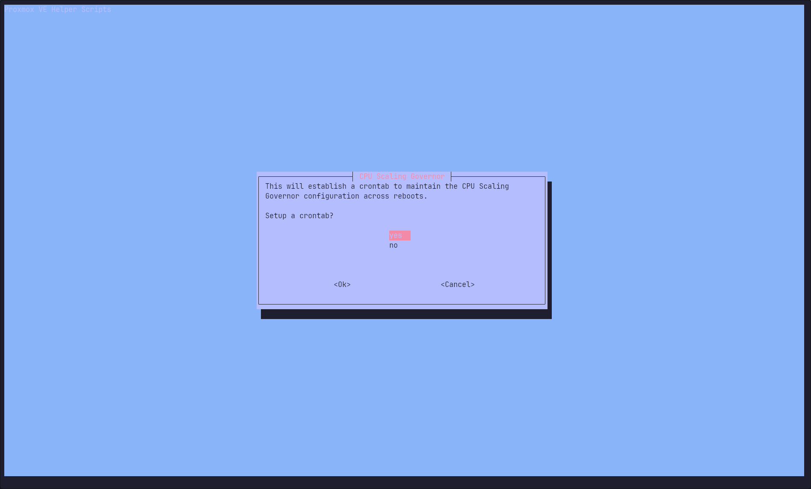
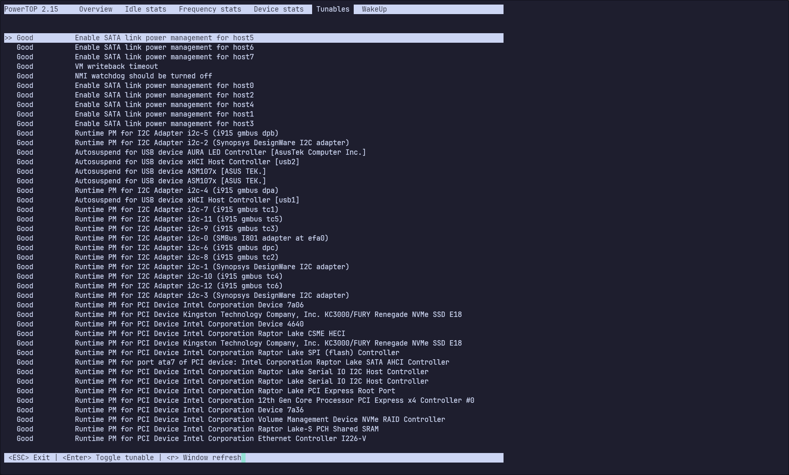
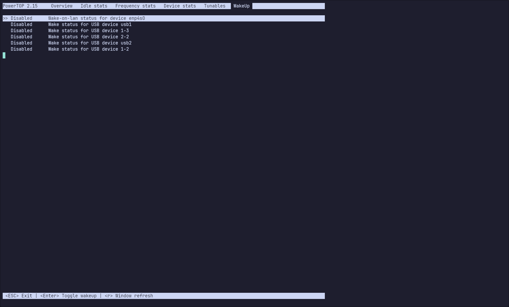
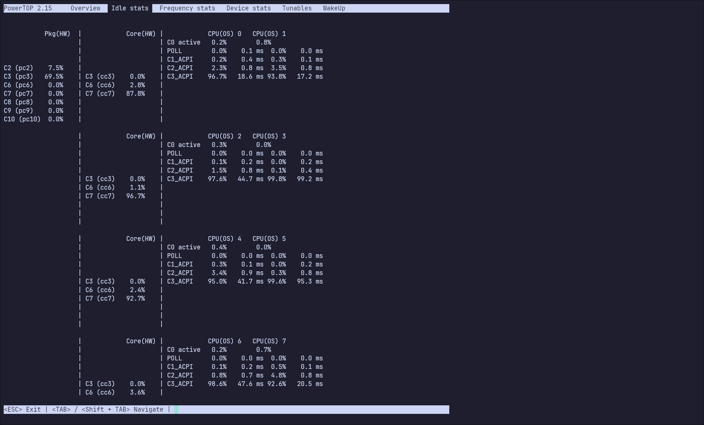

# New homelab 2024

My homelab was getting old so this black friday I decided to order some new parts. The purpose of this write up is to document the steps I took to set it up and how to reproduce it. 

This write up is coupled with a github repo containing all ansible, terraform, nixos and docker code.


## Hardware

My requirements for the homelab are: 

  - Smallish form factor.
  - Fit minimum of 4 HDD:s.
  - Be able to run containers and virtual machines for home automation, dns, backups and reverse proxy 24/7.
  - Be able to run network labs when needed.
  - A chassis that fit a ATX power supply.
  - A option to in the future install a GPU for LLMs.
  - Reasonable power usage.

These are the parts I ordered:

Type|Item
:----|:----
**CPU** | [Intel Core i5-13500 2.5 GHz 14-Core Processor](https://pcpartpicker.com/product/mtmmP6/intel-core-i5-13500-25-ghz-14-core-processor-bx8071513500)
**CPU Cooler** | [Noctua NH-L9i-17xx chromax.black 33.84 CFM CPU Cooler](https://pcpartpicker.com/product/nJqPxr/noctua-nh-l9i-17xx-chromaxblack-3384-cfm-cpu-cooler-nh-l9i-17xx-chromaxblack)
**Motherboard** | [Asus ROG STRIX B760-I GAMING WIFI Mini ITX LGA1700 Motherboard](https://pcpartpicker.com/product/YxLFf7/asus-rog-strix-b760-i-gaming-wifi-mini-itx-lga1700-motherboard-rog-strix-b760-i-gaming-wifi)
**Memory** | [Crucial Pro 96 GB (2 x 48 GB) DDR5-5600 CL46 Memory](https://pcpartpicker.com/product/BLdG3C/crucial-pro-96-gb-2-x-48-gb-ddr5-5600-cl46-memory-cp2k48g56c46u5)
**Storage** | [Western Digital Blue 1 TB 2.5" Solid State Drive](https://pcpartpicker.com/product/GTCD4D/western-digital-blue-1tb-25-solid-state-drive-wds100t2b0a)
**Storage** | [Western Digital Blue 1 TB 2.5" Solid State Drive](https://pcpartpicker.com/product/GTCD4D/western-digital-blue-1tb-25-solid-state-drive-wds100t2b0a)
**Storage** | [Kingston KC3000 1.024 TB M.2-2280 PCIe 4.0 X4 NVME Solid State Drive](https://pcpartpicker.com/product/ccFbt6/kingston-kc3000-1024-tb-m2-2280-nvme-solid-state-drive-skc3000s1024g)
**Storage** | [Kingston KC3000 1.024 TB M.2-2280 PCIe 4.0 X4 NVME Solid State Drive](https://pcpartpicker.com/product/ccFbt6/kingston-kc3000-1024-tb-m2-2280-nvme-solid-state-drive-skc3000s1024g)
**Storage** | [Seagate IronWolf NAS 4 TB 3.5" 5900 RPM Internal Hard Drive](https://pcpartpicker.com/product/6MX2FT/seagate-ironwolf-4tb-35-5900rpm-internal-hard-drive-st4000vn008)
**Storage** | [Seagate IronWolf NAS 4 TB 3.5" 5900 RPM Internal Hard Drive](https://pcpartpicker.com/product/6MX2FT/seagate-ironwolf-4tb-35-5900rpm-internal-hard-drive-st4000vn008)
**Case** | [Fractal Design Node 304 Mini ITX Tower Case](https://pcpartpicker.com/product/BWFPxr/fractal-design-case-fdcanode304bl)
**Power Supply** | [Asus ROG Strix 650 W 80+ Gold Certified Fully Modular ATX Power Supply](https://pcpartpicker.com/product/DRVG3C/asus-rog-strix-650-w-80-gold-certified-fully-modular-atx-power-supply-rog-strix-650g)

[PCPartPicker Part List](https://pcpartpicker.com/list/ZfTXPJ)


The build was easy but I regret not getting a smaller PSU. The Node 304 fit the ATX PSU without any issues but a SFX PSU would probably make the cable management easier and it would be easier to fit a full size GPU in the future.

## Proxmox installation

Create a bootable USB. I used a previously set up Ventoy stick to which i added the latest proxmox ISO.

  - [Ventoy getting started](https://www.ventoy.net/en/doc_start.html)
  - [Proxmox ISO Download](https://www.proxmox.com/en/downloads)

Boot from the USB and follow the installation guide. I choose to create a ZFS Raid1 mirror using the two NVME hard drives for Proxmox and VMs.

After the installation is complete run the [Proxmox VE Post Install](https://community-scripts.github.io/ProxmoxVE/scripts?id=post-pve-install) helperscript.

Description from the [Proxmox Helperscript website](https://community-scripts.github.io/ProxmoxVE/scripts):
> This script provides options for managing Proxmox VE repositories, including disabling the Enterprise Repo, adding or correcting PVE sources, enabling the No-Subscription Repo, adding the test Repo, disabling the subscription nag, updating Proxmox VE, and rebooting the system.

Run below as root on the proxmox server.
``` bash
bash -c "$(wget -qLO - https://github.com/community-scripts/ProxmoxVE/raw/main/misc/post-pve-install.sh)"
```
In the future i might try to create a ansible role that does the same thing since it isn't exactly best practice to run a shell script as root from an external source.

## Power consumption

### BIOS
Update the BIOS by downloading the latest version from the Asus website, unzip it and transfer it to an empty USB stick. After that boot in to BIOS, find the BIOS update utility and selected the file that was transferred to the USB stick.

Enable C-states and Native ASPM in BIOS as well as disable all unused onboard devices as Wifi and HDA. I read that disabling turbo would help but I haven't seen that in my short term idle testing so I need to verify that. I also need to document the exact BIOS settings a bit more.

### OS Settings
Install powertop, change CPU governor and enable ASPM for all PCI devices.

#### CPU Scaling Governor
For this I used another script from Proxmox Helperscript. 

Description from the [Proxmox Helperscript website](https://community-scripts.github.io/ProxmoxVE/scripts):
>The CPU scaling governor determines how the CPU frequency is adjusted based on the workload, with the goal of either conserving power or improving performance. By scaling the frequency up or down, the operating system can optimize the CPU usage and conserve energy when possible. Generic Scaling Governors

Run below as root on the proxmox server.

``` bash
bash -c "$(wget -qLO - https://github.com/community-scripts/ProxmoxVE/raw/main/misc/scaling-governor.sh)"
```
Select the powersaving scaling governor and add the cronjob.



#### Powertop
I noticed that powertop in the apt repo was out of date so I had to build it from source since the older version was lacking support for 13th gen CPU:s. Below are the commands to build powertop from source. This could probably also be changed to a ansible script in the future.
``` bash
apt install git build-essential autoconf-archive ncurses-dev libnl-3-dev libpci-dev pkg-config libtool-bin autopoint gettext libnl-genl-3-dev
git clone https://git.kernel.org/pub/scm/libs/libtrace/libtraceevent.git
cd libtraceevent; make; make install; cd ..;
git clone https://git.kernel.org/pub/scm/libs/libtrace/libtracefs.git
cd libtracefs; make; make install; cd ..;
git clone https://github.com/fenrus75/powertop.git
cd powertop
./autogen.sh
./configure
make install
```
Running `powertop` in interactive mode shows what tunables are available and what C states are being achieved by the CPU:s and package.





Running `powertop --auto-tune` will set all tunables to GOOD. To make the tweaks persistent create a systemd service to run `powertop --auto-tune` at each boot.
``` bash
nano /etc/systemd/system/powertop.service
```
Add below to that file.
``` bash
[Unit]
Description=Powertop tunings

[Service]
Type=oneshot
RemainAfterExit=yes
ExecStart=/usr/local/sbin/powertop --auto-tune

[Install]
WantedBy=multi-user.target
```
Reload systemctl and enable the service.
``` bash
systemctl daemon-reload
systemctl enable powertop.service
```
#### Auto ASPM
Description from the [Wikipedia site for ASPM](https://en.wikipedia.org/wiki/Active_State_Power_Management):
>Active-state power management (ASPM) is a power management mechanism for PCI Express devices to garner power savings while otherwise in a fully active state. 

The Auto ASPM script enables ASPM for all PCIe devices that support it.

Download the Auto ASPM Script and run it.
``` bash
wget https://raw.githubusercontent.com/notthebee/AutoASPM/refs/heads/main/autoaspm.py
python3 autoaspm.py
00:06.0: Already has ASPM L0sL1 enabled
00:1a.0: Already has ASPM L1 enabled
00:1c.0: Already has ASPM L0sL1 enabled
00:1c.2: Already has ASPM L1 enabled
00:1d.0: Already has ASPM L0sL1 enabled
01:00.0: Already has ASPM L1 enabled
02:00.0: Already has ASPM L1 enabled
04:00.0: Already has ASPM L1 enabled
```
Like with powertop create a service that runs it at each boot.

``` bash
nano /etc/systemd/system/autoaspm.service
```
Add below to that file.
``` bash
[Unit]
Description=Automatically activate ASPM on all supported devices

[Service]
Type=oneshot
ExecStart=/usr/bin/python3 /root/autoaspm.py

[Install]
WantedBy=multi-user.target
```
Reload systemctl and enable the service.
``` bash
systemctl daemon-reload
systemctl enable autoaspm.service
```
### Conclusion

With only the NVME mirror and networking connected i was able to get the server to idle around 18W but if I disconnect the network cable it drops to 13W. I've tried updating to a kernel with newer drivers, disabling WOL, enabling EEE and combed the Internet for firmware patches but nothing seems to make a difference. I also tried to install a separate PCIe network card but it didn't make any difference either. My guess is that it might not be the network card that draws 5W but rather that the cpu package can't get to higher C-states while networking is active.


## SSH credentials

Generate SSH keys with the commands below. You will be prompted to set a password for each key, it's recommended to do so. I use one key for github, one for proxmox and one for the rest of my homelab.

``` bash
ssh-keygen -t ed25519 -C "$(whoami)@proxmox-$(hostname)" -f ~/.ssh/proxmox 
ssh-keygen -t ed25519 -C "$(whoami)@homelab-$(hostname)" -f ~/.ssh/homelab  
ssh-keygen -t ed25519 -C "$(whoami)@github-$(hostname)"  -f ~/.ssh/github
```
Copy the proxmox public key to trusted hosts of the proxmox server using ssh-copy-id.
``` bash
ssh-copy-id -i ~/.ssh/proxmox root@10.0.10.10
```

Edit the SSH config to use the generated key and specify which user to use.

``` bash
nano ~/.ssh/config
...
Host github.com
  HostName github.com
  IdentityFile ~/.ssh/github
Host 10.0.10.10
  IdentityFile ~/.ssh/proxmox
  User root
Host 10.0.10.*
  IdentityFile ~/.ssh/homelab
  User robin
...
```

Add the SSH keys to the SSH agent. That way you wont be prompted for the password for each ssh connection until you close the terminal.
``` bash
eval "$(ssh-agent -s)"
ssh-add ~/.ssh/proxmox
ssh-add ~/.ssh/homelab
ssh-add ~/.ssh/github
```

## Proxmox API credentials


To be able to use Ansible and Terraform to manage Proxmox it's recommended to use API credentials instead of username/password combination. To create those credentials follow the steps bellow logged in as root on the Proxmox server.


Add a user:
``` bash
pveum user add homelab@pve
```
Create a role:
```bash
pveum role add HomeLab -privs "Datastore.Allocate Datastore.AllocateSpace Datastore.AllocateTemplate Datastore.Audit Pool.Allocate Sys.Audit Sys.Console Sys.Modify SDN.Use VM.Allocate VM.Audit VM.Clone VM.Config.CDROM VM.Config.Cloudinit VM.Config.CPU VM.Config.Disk VM.Config.HWType VM.Config.Memory VM.Config.Network VM.Config.Options VM.Migrate VM.Monitor VM.PowerMgmt User.Modify"
```
Assign the role to the new user:
```bash
pveum aclmod / -user homelab@pve -role HomeLab
```
Create a authentication token: 
```bash
pveum user token add homelab@pve iac --privsep=0
```
Then you will presented with something similar to below, save the full-tokenid and value in a safe place for later.
```bash
┌──────────────┬──────────────────────────────────────┐
│ key          │ value                                │
╞══════════════╪══════════════════════════════════════╡
│ full-tokenid │ homelab@pve!iac                      │
├──────────────┼──────────────────────────────────────┤
│ info         │ {"privsep":"0"}                      │
├──────────────┼──────────────────────────────────────┤
│ value        │ 207c9ff1-96f3-44d4-8439-87da57f5fc26 │
└──────────────┴──────────────────────────────────────┘
```

## Github

Get the generated github public key and add it to your github account at [Github keys](https://github.com/settings/keys)
```bash
cat .ssh/github.pub
```
Configure git
```bash
git config --global user.name Ragr3n
git config --global user.email robin@ragren.com
```

Clone the repository
```bash
git clone XXX 
```

## Dependencies  

The repo contains files and folders required to manage my homelab and to make life easier a nix shell is provided with all dependencies that are needed to run Ansible, Tofu, nixos-rebuild, SOPS and some other utility's. The shell has only been tested on NixOS but should probably work as long as the Nix package manager is installed.

```bash
nix develop
```

## SOPS: Secrets OPerationS

SOPS is a editor that encrypts/decrypts files. One way to use SOPS is to store variables in a yaml file and encrypt the values using a age keypair derived from a SSH key. We can then use the variables in Ansible, Tofu and NixOS and store our secret variables in git.


Create a folder to store age keys in and use the previously generated SSH key to create age keypair.
```bash
mkdir -p ~/.config/sops/age/
nix run nixpkgs#ssh-to-age -- -private-key -i ~/.ssh/homelab > ~/.config/sops/age/keys.txt
nix shell nixpkgs#age -c age-keygen -y ~/.config/sops/age/keys.txt

age1gwmxg9kqrkfqek4lkkv0l70tsjlvftj4jrevu6a8pf0m34smp43qc27wys
```
Copy the age key that is shown in the terminal and add it to the .sops.yaml file located in the root of the project. If the file doesn't exist create it with this content and change the age key to the one you generated.
```bash
keys:
  - &primary age1gwmxg9kqrkfqek4lkkv0l70tsjlvftj4jrevu6a8pf0m34smp43qc27wys
creation_rules:
  - path_regex: secrets/[^/]+\.(yaml|json|env|ini)$
    #- path_regex: secrets/secrets.yaml$
    key_groups:
      - age:
          - *primary
```

I've saved the clear text version of the secrets/secrets.yaml file in bitwarden but it's also possible to just take the content of secrets/secrets.yaml remove the sops: array and edit the variables since the variable names are stored in clear text. Then use below command to encrypt the file.

```bash
sops -i -e secrets/secrets.yaml
```
Be careful to not commit the file without first encrypting it. Use the VSCode extension @signageos/vscode-sops to easily edit SOPS encrypted files and automatically encrypt them.


## Templates

I've created a couple of ansible roles to deploy VM and LXC templates to proxmox, this is how to use them.

Change in to the Ansible directory, edit the inventory/proxmox.yaml file and run one or more playbooks to generate VM or LXC templates in Proxmox.
```bash
hl-ansible #Alias for cd *homelabdir*/ansible
code inventory/proxmox.yml
ansible-playbook create-template-nixos-vm.yml -i inventory/proxmox.yml
ansible-playbook create-template-nixos-lxc.yml -i inventory/proxmox.yml
ansible-playbook create-template-hassos-vm.ymlt -i inventory/proxmox.yml  
```

## OpenTofu

OpenTofu is a opensource fork of terraform that makes it possible to define infrastructure as code. 

I've chosen to keep the provider config in the main.tf file and separate pve-****-.tf files for each deployed node. This way I can easily edit, create new or destroy nodes without affecting others.

Change in to the tofu directory, copy and or edit tofu files as desired.

```bash
hl-tofu #Alias for cd *homelabdir*/tofu
code main.tf
cp pve-vm-nixos-01.tf pve-vm-nixos-02.tf
code pve-vm-nixos-02.tf
```

Plan the config and make sure it looks alright and then apply it.
```bash
tofu plan
# Output removed
tofu apply 
data.sops_file.secrets: Reading...
data.sops_file.secrets: Read complete after 0s [id=-]
OpenTofu used the selected providers to generate the following execution plan. Resource actions are indicated with the following symbols:
  + create

OpenTofu will perform the following actions:

  # proxmox_virtual_environment_vm.vm-nixos-02 will be created
  + resource "proxmox_virtual_environment_vm" "vm-nixos-02" {
      + acpi                    = true
      + bios                    = "seabios"
      + id                      = (known after apply)
      + ipv4_addresses          = (known after apply)
      # Output abbreviated
    }

Plan: 1 to add, 0 to change, 0 to destroy.

Do you want to perform these actions?
  OpenTofu will perform the actions described above.
  Only 'yes' will be accepted to approve.

  Enter a value: yes

proxmox_virtual_environment_vm.vm-nixos-02: Creating...
proxmox_virtual_environment_vm.vm-nixos-02: Creation complete after 8s 
```

## Adding keys to SOPS

To be able to deploy NixOS configurations that utilizes SOPS secrets to remote servers, the remote servers age key needs to be added to the .sops.yaml file.

To make the process a bit easier i've made a shell script (update-age) that takes an IP as input and then adds the public ssh key to known_hosts, adds the key to .sops.yaml and updates encryption keys for secrets/secrets.yaml

```bash
update-age 
IP-address: 10.0.10.30
Syncing keys for file ./secrets/secrets.yaml
The following changes will be made to the file's groups:
Group 1
    age1gwmxg9kqrkfqek4lkkv0l70tsjlvftj4jrevu6a8pf0m34smp43qc27wys
+++ age1gwmxg9kqrkfqek4lkkv0l70tsjlvftj4jrevu6a8pf0m34smp43qc27hek
```

## NixOS

NixosConfigurations created in the flake.nix can be deployed by using nixos-rebuild and specifying --target-host


```bash
hl-root #Alias for cd *homelabdir*
nixos-rebuild switch --flake .#vm-nixos-01 --target-host 10.0.10.30 --use-remote-sudo
nixos-rebuild switch --flake .#lxc-nixos-01 --target-host 10.0.10.31 --use-remote-sudo
```

## Reboot

It is probably a good idea to reboot the newly created LXC:s or VM:s once after creation and initial deploy. That can be accomplished by this one liner.
```bash
ssh 10.0.10.30 "sudo reboot"
ssh 10.0.10.31 "sudo reboot"
```